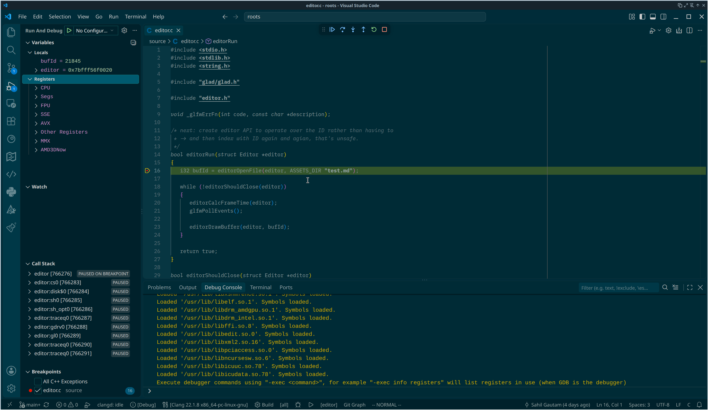

# roots

## Development Setup
- Run `scripts/dependencies.sh` to install dependencies
- See `configs/vscode` for an example vscode config

## Bulid Steps
```bash
make init
make debug
```

## Debugging
- Open VSCode ('ms-vscode.cmake-tools', 'ms-vscode.cpptools' etc extensions, see [extensions.json](./config/vscode/.vscode/extensions.json))
- Put a breakpoint & Press `<SHIFT-F5>`

## Coding Style
- Always assign all the values in the struct initializer lists, we use -1 for IDs, default initialization sets values to 0.
- Don't prefix the function names unnecessarily, use `openFile` instead of `editorOpenFile`. For subsystems, use minimal prefixes, `fmInit` instead of `fontManagerInit`.



## LLM Policy

> [!NOTE]
> I do not use LLMs for this project, and I will not take patches written by one.
> Here we read the docs and the code, try things, make mistakes, discuss those on
> IRC, fix them and document the whole process in `log.txt`. The goal is
> learning...
